# Smartwatch-Data-Analysis
Smartwatch data analysis with usage of ML algorithms. Analysis will be performed on an uncleared dataset.

Data cleaning and statistical analysis will be done with **Pandas**. 

In addition a dimensionality reduction and clustering algorithms will be used on the dataset. Each one will be implemented from scratch with **PyTorch**. The reason for implementing these from scratch is my will to better understand how these algorithms work.

Plots are done with **Matplotlib**.

*Workflow*

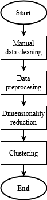

## Table of Contents
1. [Dataset](#dataset)
	- [Dataset Class](#dataset-class)
2. [Statistical Measurements](#statistical-measurements)
3. [Machine learning algorithms](#machine-learning-algorithms)
	- [PCA](#principal-component-analysis-pca)
	- [K-Means](#k-means)
4. [Results](#results)
	- [Data cleaning](#data-cleaning)
	- [Data Preprocessing](#data-preprocessing)
	- [PCA](#pca)
	- [K-Means](#k-means-1)
	- [Clusters analysis](#clusters-analysis)
5. [Showcase of different clusters](#showcase-of-different-clusters)
6. [Notes](#notes)

## Dataset
Dataset that would be analyzed is an uncleaned collection of smartwatch health data. This collection is result of a simulation that should mimic a real-word problems with uncleared dataset. Dataset can be found on **https://www.kaggle.com/datasets/mohammedarfathr/smartwatch-health-data-uncleaned**.

**Dataset overview**

* Uncleaned dataset
* 10 000 records
* 7 features:
	+ User ID
	+ Heart Rate (BPM)
	+ Blood Oxygen Level (%)
	+ Step Count
	+ Sleep Duration (hours)
	+ Activity Level
	+ Stress Level

### Dataset Class
The dataset is stored inside of a CustomDataset class. The main reason for implementing this class is its usage with PyTorch's **DataLoader** that allow to effectively iterate through the dataset (even with batching). Another key features the class is that it stores separated ids, original (not normalized) and normalized data. In addition normalizing functions are implemented here as static methods.

## Statistical Measurements
Following measurements are used for statistical analysis of the dataset.

<table>
    <tr>
        <td>Count</td>
        <td>Number of records</td>
    </tr>
    <tr>
        <td>Minimum</td>
        <td>Minimum value</td>
    </tr>
    <tr>
        <td>Maximum</td>
        <td>Maximum value</td>
    </tr>
    <tr>
        <td>Mean</td>
        <td>Mean value</td>
    </tr>
    <tr>
        <td>25th percentile</td>
        <td>1st quartile (25% of the data is smaller, 75% is higher)</td>
    </tr>
    <tr>
        <td>Median</td>
        <td>Middle value (50% of the data is smaller, 50% is higher)</td>
    </tr>
    <tr>
        <td>75th percentile</td>
        <td>3rd quartile (75% of the data is smaller, 25% is higher)</td>
    </tr>
    <tr>
        <td>Variance</td>
        <td>How much is the data spread around the mean</td>
    </tr>
    <tr>
        <td>Standard Deviation</td>
        <td>Square root of variance (how much data deviates from the mean)</td>
    </tr>
    <tr>
        <td>Skewness</td>
        <td>Data symmetry (~0 => symmetric distribution)</td>
    </tr>
    <tr>
        <td>Excess Kurtosis</td>
        <td>Identifying extreme outliers (~0 without outliers)</td>
    </tr>
</table>

## Machine Learning Algorithms

### Principal Component Analysis (PCA)
Implementation of PCA will serve for dataset dimensionality reduction. The dataset will be reduced to 2 dimensions so it can be well visualized. The goal of this algorithm is to perform this reduction with minimum information lost.

In this project PCA is implemented as following.

*PCA Workflow*

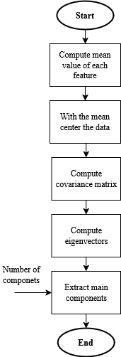

At the beginning a mean value of each feature is computed. This value is then used to center the data (mean of each feature will be 0). The centering is a form of normalizing the data for better PCA performance (without centering the result components could be shifted). Next step is to compute the corelation matrix that contains information about correlations between each feature. From correlation matrix eigenvectors are computed. Eigenvector represents a direction in which the feature has maximum variance. This basically says which feature varies the most, means that this feature will have stronger impact on the data than more steady ones. Last step is an extraction of the components (each component we can imagine as a dimension). As mentioned before we extract the components with the highest variance.

In this PCA implementation there is also a method for computing MSE (Mean Square Error). This method reconstructs the reduced data back to its original form and computes the MSE of each feature. This error shows how different are reconstructed data from the original (shows how much information was lost in the transformation process).

### K-Means
K-Means is a clustering algorithm from unsupervised algorithms family. This algorithm takes input data and group similar ones (in some way) into a cluster. This way we can separate the data into groups. The main thing about this algorithm is to position centroid inside a space. Each of these centroid represents a cluster (area). The goal is to have the space separated into clusters. Result of this is that if we input a data point it will land inside of these clusters are and we can assign a label (group to it).

*K-Means Workflow*

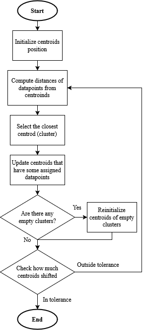

First step in fitting process is to initialize centroids positions. In this project the initialization was done with a help of the first batch of data. From this batch a random data points are chosen (number of chosen points = number of clusters). Centroids positions are the same as positions of these data points (another approach could be a pure random initialization = generating random number as position). This approach (position from batch) was chosen because it assures that each cluster will have at least 1 data point assigned to it (why this is good will be mentioned later).

After initialization computation of distances will be performed. This means that for each data point (from batch) there will be computed its distance (Euclidean distance) to each of the centroids. Within these distances the smallest one will be taken for each data point = the point is assigned to the centroid (cluster).

Each centroid that has some points assigned to it will be updated. Updating simply means adjusting centroids position in the space. The main part of the update is addition of the mean value of the points that are assigned to that centroid (mean of the cluster). This can be imaged as moving the centroid towards the center of the cluster area. After updating centroids with assigned points there is a check if there are any empty clusters (centroids without assigned data points) that haven't been updated. If there is an empty cluster, its centroid will be reinitialized. This reinitialization is similar to the original one from the first step. The difference is that this time the random position is taken from the last batch (that is currently still in memory) instead of the first one that would have to be loaded again (inefficient). The point of reinitializing the centroid (changing its position) is to make sure it doesn't stay empty (useless).

*Centroid update (with learning rate that allows better control over the algorithm, especially in case of problems with algorithm convergence)*

$C_{\text{new}} = (1 - \alpha) C_{\text{old}} + \alpha \cdot {\text{mean}}$

Last step is to check for the convergence. If the centroid between epochs shifted less than provided tolerance the algorithm ends. In other case data points are again provided for new round of distances computing, etc.

*Euclidean distance*

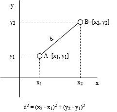

## Results
In this chapter outputs of the program will be presented. Outputs are in forms of terminal print or a plot.

### Data Cleaning
The goal of data cleaning is to kinda format the original dataset so it has **only valid numeric values**.

Data cleaning was done manually step by step. This means that the cleaning code is suited only on this specific dataset. The basic idea of the cleaning is simple. First analyze some feature then if there is a problem write code to handle it.

The first pieces of information
```
Incomplete records: 1457

Duplicated records: 0
```
The problem here is 1457 incomplete records. As a solution the most basic principle was used = dropping the records. Alternatively if this approach wouldn't suit our dataset we could try to fill the missing information with approximation (for example putting mean values). I this case I told myself it is okay to drop them.

Now moving on to **Activity Level** column because it has string values and we want only numeric ones.
```
Number of unique values in Activity Level column: 6
Unique values of Activity Level column: ['Highly Active' 'Actve' 'Highly_Active' 'Seddentary' 'Sedentary' 'Active']
```
This tells us that there are 6 unique values (but basically 3 due to different spelling) in Activity level column. With this knowledge we can simply replace these string with numbers.

<table>
  <tr>
	<th>String value</th>
	<th>Numeric value</th>
  </tr>
  <tr>
	<td>Sedentary</td>
	<td>1</td>
  </tr>
  <tr>
	<td>Active</td>
	<td>2</td>
  </tr>
  <tr>
	<td>Highly Active</td>
	<td>3</td>
  </tr>
</table>

Now all values should be numeric so there is a check.
```
All values are numeric: False
Columns with non-numeric values: ['Sleep Duration (hours)', 'Stress Level']
```
We can see that all values aren't numeric. So lets fix that.

First we look at **Stress Level** column.
```
Number of unique values in Stress Level column: 11
Unique values of Stress Level column: ['1' '5' '3' '10' '2' '8' '9' 'Very High' '7' '6' '4']
```
It looks like there is one value set with words, others contains number. Handling this is pretty simple. We will replace 'Very High' string with value 8 (I assume that it could mean 8) and other values just convert to numeric datatype.

To this point we checked the columns for unique values because the field of values was discreet (couple of whole numbers). For **Sleep Duration** column this approach isn't good because it has a whole spectrum of values. So instead of analyzing unique values we look just at non numeric values.
```
Non-numeric values in Sleep Duration column: ['7.167235622316564' 'ERROR' '7.367789630207228' ... '6.3821659358529015'
 '6.91654920303435' '5.691001039740254']
```
It looks like there are numbers just putted as strings. The problem are the 'ERROR' values. Again, solution could be approximating the value (isn't as easy as in Stress Level column) or we can say it is okay to drop it. So we try to convert the values into numeric datatype and where this isn't allowed (string without a number) the value will be replaced with NaN (None, or empty cell). After that we simply drop the records with NaN.
```
Sleep Duration column has NaN values: True
Number of NaN values: 218
```
Now we should have all numbers numeric. What we will check now is if the **User ID** has only unique values (ids should be unique and not repeating).
```
All IDs are unique : False
Number of unique values in User ID column: 3473
```
Result is that there is only 3473 unique ids between over 8000 records. This crazy ration doesn't allow us to drop the repeating ids. So to handle this we just replace the whole column with new (unique) ids. (We can do it like this because we know from earlier that are isn't any duplicates records, so even the ids are same for some records the other values are not).

**Result of cleaning**
```
Original number of records: 10000
Number of records after preprocessing: 8325
All values are numeric: True
All IDs are unique : True
```

### Data Preprocessing
The purpose of data preprocessing it to further (than cleaning) prepare the data for processing. The main thing in this process is **data normalization**.

For normalization a Z-Score function was chosen. The reason for this choice is that the normalized data has low mean value which is good for following algorithms (specially PCA). On the other hand Min-Max normalization (which is implemented but not used) only shrinks the values between 0 and 1. (We are not normalizing ids because there is no point to it, ids are not use in analysis or algorithms, they are just to identify users).

*Z-score normalizing fomula*

$Z = \frac{\text{Value to Normalize} - \text{Mean}}{\text{Standard Deviation}}$

*Correlation Matrix*

<table>
  <tr>
	<th></th>
	<th>Heart Rate (BPM)</th>
	<th>Blood Oxygen Level (%)</th>
	<th>Step Count</th>
	<th>Sleep Duration (hours)</th>
	<th>Activity Level</th>
	<th>Stress Level</th>
  </tr>
  <tr>
	<td>Heart Rate (BPM)</td>
	<td>1.000</td>
	<td>-0.018</td>
	<td>0.002</td>
	<td>0.007</td>
	<td>0.003</td>
	<td>-0.010</td>
  </tr>
  <tr>
	<td>Blood Oxygen Level (%)</td>
	<td>-0.018</td>
	<td>1.000</td>
	<td>0.003</td>
	<td>0.002</td>
	<td>-0.010</td>
	<td>-0.007</td>
  </tr>
  <tr>
	<td>Step Count</td>
	<td>0.002</td>
	<td>0.003</td>
	<td>1.000</td>
	<td>0.007</td>
	<td>0.002</td>
	<td>0.011</td>
  </tr>
  <tr>
	<td>Sleep Duration (hours)</td>
	<td>0.007</td>
	<td>0.002</td>
	<td>0.007</td>
	<td>1.000</td>
	<td>0.002</td>
	<td>-0.007</td>
  </tr>
  <tr>
	<td>Activity Level</td>
	<td>0.003</td>
	<td>-0.010</td>
	<td>0.002</td>
	<td>0.002</td>
	<td>1.000</td>
	<td>-0.011</td>
  </tr>
  <tr>
	<td>Stress Level</td>
	<td>-0.010</td>
	<td>-0.007</td>
	<td>0.011</td>
	<td>-0.007</td>
	<td>-0.011</td>
	<td>1.000</td>
  </tr>
</table>

Corelation matrix tells us how correlative are features between each other. We look at this because PCA couldn't be a good choice for some highly correlative dataset. In our case correlation looks good (near 0).

### PCA
In this case we will use PCA to reduce the dataset dimension from 6 (without ids) to 2. With **2 dimensions** we can easily visualize the data points.

*Dataset analysis*

<table>
  <tr>
	<th></th>
	<th>Heart Rate (BPM)</th>
	<th>Blood Oxygen Level (%)</th>
	<th>Step Count</th>
	<th>Sleep Duration (hours)</th>
	<th>Activity Level</th>
	<th>Stress Level</th>
  </tr>
  <tr>
	<td>Count</td>
	<td>8325.00</td>
	<td>8325.00</td>
	<td>8325.00</td>
	<td>8325.00</td>
	<td>8325.00</td>
	<td>8325.00</td>
  </tr>
  <tr>
	<td>Minimum</td>
	<td>40.00</td>
	<td>90.79</td>
	<td>0.91</td>
	<td>-0.19</td>
	<td>1.00</td>
	<td>1.00</td>
  </tr>
  <tr>
	<td>Maximum</td>
	<td>292.92</td>
	<td>100.00</td>
	<td>62486.95</td>
	<td>12.14</td>
	<td>3.00</td>
	<td>10.00</td>
  </tr>
  <tr>
	<td>Mean</td>
	<td>75.99</td>
	<td>97.84</td>
	<td>7004.26</td>
	<td>6.50</td>
	<td>1.99</td>
	<td>5.45</td>
  </tr>
  <tr>
	<td>25th percentile</td>
	<td>64.92</td>
	<td>96.65</td>
	<td>1994.06</td>
	<td>5.48</td>
	<td>1.00</td>
	<td>3.00</td>
  </tr>
  <tr>
	<td>Median</td>
	<td>75.31</td>
	<td>98.00</td>
	<td>4980.22</td>
	<td>6.50</td>
	<td>2.00</td>
	<td>5.00</td>
  </tr>
  <tr>
	<td>75th percentile</td>
	<td>85.31</td>
	<td>99.38</td>
	<td>9767.41</td>
	<td>7.53</td>
	<td>3.00</td>
	<td>8.00</td>
  </tr>
  <tr>
	<td>Variance</td>
	<td>361.52</td>
	<td>3.02</td>
	<td>479074.20</td>
	<td>2.28</td>
	<td>0.67</td>
	<td>8.23</td>
  </tr>
  <tr>
	<td>Standard Deviation</td>
	<td>19.01</td>
	<td>1.74</td>
	<td>6921.52</td>
	<td>1.51</td>
	<td>0.82</td>
	<td>2.87</td>
  </tr>
  <tr>
	<td>Skewness</td>
	<td>3.63</td>
	<td>-0.57</td>
	<td>1.98</td>
	<td>0.01</td>
	<td>0.02</td>
	<td>0.02</td>
  </tr>
  <tr>
	<td>ExcessKurtosis</td>
	<td>33.29</td>
	<td>-0.30</td>
	<td>6.03</td>
	<td>-0.07</td>
	<td>-1.50</td>
	<td>-1.23</td>
  </tr>
</table>

*Mean square errors*

1. feature variance: 361.52, reconstruction error: 0.60
2. feature variance: 3.02, reconstruction error: 0.47
3. feature variance: 47907416.00, reconstruction error: 0.84
4. feature variance: 2.28, reconstruction error: 0.91
5. feature variance: 0.67, reconstruction error: 0.80
6. feature variance: 8.23, reconstruction error: 0.35

From this errors we can see that feature 5 (Activity Level) has the highest relative error to its original variance. This means that PCA didn't captured (or ignored) information from this feature (seems that it is least important).

At this point we can start plotting the data points into 2D graph. Based on this graph we will also remove outliers (= points with extreme values that could bring some bias to future processing). The phrase "Based on this graph" tells us that outliers detection was done manually (by looking at the graph) and setting thresholds for dropping them as well.

*After PCA data points*

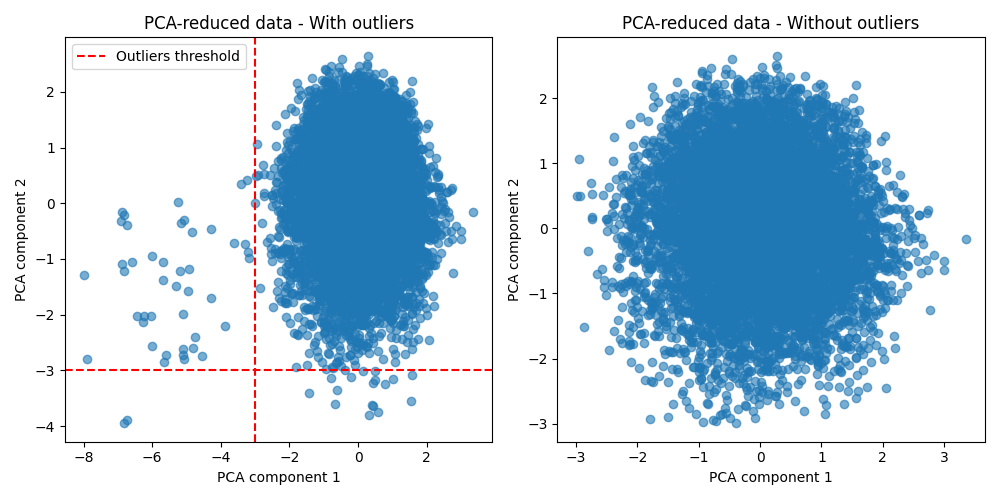

```
Removed outliers: 63
Number of records without outliers: 8262
```

Threshold were set -3.0 for both of the components (axis).

*Dataset without outliers analysis*

<table>
  <tr>
	<th></th>
	<th>Heart Rate (BPM)</th>
	<th>Blood Oxygen Level (%)</th>
	<th>Step Count</th>
	<th>Sleep Duration (hours)</th>
	<th>Activity Level</th>
	<th>Stress Level</th>
  </tr>
  <tr>
	<td>Count</td>
	<td>8262.00</td>
	<td>8262.00</td>
	<td>8262.00</td>
	<td>8262.00</td>
	<td>8262.00</td>
	<td>8262.00</td>
  </tr>
  <tr>
	<td>Minimum</td>
	<td>40.00</td>
	<td>90.79</td>
	<td>0.91</td>
	<td>-0.19</td>
	<td>1.00</td>
	<td>1.00</td>
  </tr>
  <tr>
	<td>Maximum</td>
	<td>127.59</td>
	<td>100.00</td>
	<td>62486.69</td>
	<td>12.14</td>
	<td>3.00</td>
	<td>10.00</td>
  </tr>
  <tr>
	<td>Mean</td>
	<td>75.15</td>
	<td>97.85</td>
	<td>6939.99</td>
	<td>6.50</td>
	<td>1.99</td>
	<td>5.44</td>
  </tr>
  <tr>
	<td>25th percentile</td>
	<td>64.89</td>
	<td>96.67</td>
	<td>1990.46</td>
	<td>5.48</td>
	<td>1.00</td>
	<td>3.00</td>
  </tr>
  <tr>
	<td>Median</td>
	<td>75.21</td>
	<td>98.01</td>
	<td>4961.77</td>
	<td>6.50</td>
	<td>2.00</td>
	<td>5.00</td>
  </tr>
  <tr>
	<td>75th percentile</td>
	<td>85.13</td>
	<td>99.38</td>
	<td>9722.22</td>
	<td>7.53</td>
	<td>3.00</td>
	<td>8.00</td>
  </tr>
  <tr>
	<td>Variance</td>
	<td>219.18</td>
	<td>2.99</td>
	<td>45644075.00</td>
	<td>2.28</td>
	<td>0.67</td>
	<td>8.21</td>
  </tr>
  <tr>
	<td>Standard Deviation</td>
	<td>14.80</td>
	<td>1.73</td>
	<td>6756.04</td>
	<td>1.51</td>
	<td>0.82</td>
	<td>2.87</td>
  </tr>
  <tr>
	<td>Skewness</td>
	<td>0.04</td>
	<td>-0.57</td>
	<td>1.83</td>
	<td>0.00</td>
	<td>0.02</td>
	<td>0.02</td>
  </tr>
  <tr>
	<td>ExcessKurtosis</td>
	<td>-0.22</td>
	<td>-0.33</td>
	<td>4.77</td>
	<td>-0.07</td>
	<td>-1.50</td>
	<td>-1.22</td>
  </tr>
</table>

### K-Means
Now we are ready for the clustering. In this case we will separate the data into **3 clusters**.\

*Clustered data points*

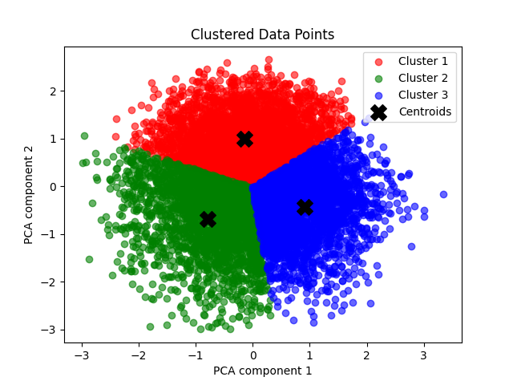

```
K-Means converged at epoch 11
Number of records in 1. cluster: 3057
Number of records in 2. cluster: 2409
Number of records in 3. cluster: 2796
```
We can see that data points are spread kinda evenly between all of the clusters

### Clusters analysis

**First Cluster**

*First cluster analysis*

<table>
  <tr>
	<th></th>
	<th>Heart Rate (BPM)</th>
	<th>Blood Oxygen Level (%)</th>
	<th>Step Count</th>
	<th>Sleep Duration (hours)</th>
	<th>Activity Level</th>
	<th>Stress Level</th>
  </tr>
  <tr>
	<td>Count</td>
	<td>3057.00</td>
	<td>3057.00</td>
	<td>3057.00</td>
	<td>3057.00</td>
	<td>3057.00</td>
	<td>3057.00</td>
  </tr>
  <tr>
	<td>Minimum</td>
	<td>40.00</td>
	<td>94.25</td>
	<td>3.06</td>
	<td>1.40</td>
	<td>1.00</td>
	<td>1.00</td>
  </tr>
  <tr>
	<td>Maximum</td>
	<td>122.74</td>
	<td>100.00</td>
	<td>35250.86</td>
	<td>12.14</td>
	<td>3.00</td>
	<td>10.00</td>
  </tr>
  <tr>
	<td>Mean</td>
	<td>74.45</td>
	<td>98.66</td>
	<td>4805.36</td>
	<td>6.73</td>
	<td>2.09</td>
	<td>3.11</td>
  </tr>
  <tr>
	<td>25th percentile</td>
	<td>64.28</td>
	<td>97.74</td>
	<td>1444.65</td>
	<td>5.74</td>
	<td>1.00</td>
	<td>2.00</td>
  </tr>
  <tr>
	<td>Median</td>
	<td>74.22</td>
	<td>98.89</td>
	<td>3420.06</td>
	<td>6.71</td>
	<td>2.00</td>
	<td>3.00</td>
  </tr>
  <tr>
	<td>75th percentile</td>
	<td>84.30</td>
	<td>99.97</td>
	<td>6745.32</td>
	<td>7.78</td>
	<td>3.00</td>
	<td>4.00</td>
  </tr>
  <tr>
	<td>Variance</td>
	<td>204.26</td>
	<td>1.57</td>
	<td>21254720.00</td>
	<td>2.18</td>
	<td>0.65</td>
	<td>3.36</td>
  </tr>
  <tr>
	<td>Standard Deviation</td>
	<td>14.29</td>
	<td>1.25</td>
	<td>4610.28</td>
	<td>1.48</td>
	<td>0.81</td>
	<td>1.83</td>
  </tr>
  <tr>
	<td>Skewness</td>
	<td>0.07</td>
	<td>-0.69</td>
	<td>1.77</td>
	<td>-0.01</td>
	<td>-0.16</td>
	<td>0.74</td>
  </tr>
  <tr>
	<td>ExcessKurtosis</td>
	<td>-0.21</td>
	<td>-0.40</td>
	<td>4.25</td>
	<td>-0.07</td>
	<td>-1.45</td>
	<td>-0.13</td>
  </tr>
</table>

*First cluster histograms*

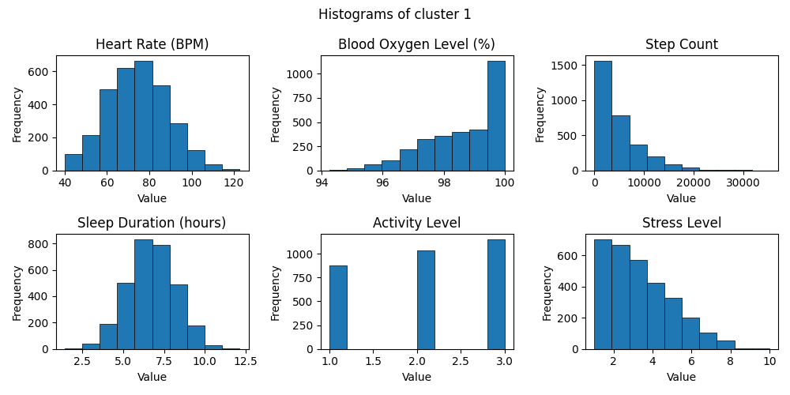

**Second Cluster**

*Second cluster analysis*

<table>
  <tr>
	<th></th>
	<th>Heart Rate (BPM)</th>
	<th>Blood Oxygen Level (%)</th>
	<th>Step Count</th>
	<th>Sleep Duration (hours)</th>
	<th>Activity Level</th>
	<th>Stress Level</th>
  </tr>
  <tr>
	<td>Count</td>
	<td>2409.00</td>
	<td>2409.00</td>
	<td>2409.00</td>
	<td>2409.00</td>
	<td>2409.00</td>
	<td>2409.00</td>
  </tr>
  <tr>
	<td>Minimum</td>
	<td>40.00</td>
	<td>90.79</td>
	<td>1.89</td>
	<td>1.99</td>
	<td>1.00</td>
	<td>1.00</td>
  </tr>
  <tr>
	<td>Maximum</td>
	<td>127.59</td>
	<td>100.00</td>
	<td>62486.69</td>
	<td>11.91</td>
	<td>3.00</td>
	<td>10.00</td>
  </tr>
  <tr>
	<td>Mean</td>
	<td>82.52</td>
	<td>96.22</td>
	<td>8165.93</td>
	<td>6.71</td>
	<td>2.29</td>
	<td>5.95</td>
  </tr>
  <tr>
	<td>25th percentile</td>
	<td>73.67</td>
	<td>95.25</td>
	<td>2584.23</td>
	<td>5.68</td>
	<td>2.00</td>
	<td>4.00</td>
  </tr>
  <tr>
	<td>Median</td>
	<td>82.27</td>
	<td>96.21</td>
	<td>6227.12</td>
	<td>6.70</td>
	<td>2.00</td>
	<td>6.00</td>
  </tr>
  <tr>
	<td>75th percentile</td>
	<td>91.66</td>
	<td>97.22</td>
	<td>11595.19</td>
	<td>7.69</td>
	<td>3.00</td>
	<td>8.00</td>
  </tr>
  <tr>
	<td>Variance</td>
	<td>186.69</td>
	<td>2.27</td>
	<td>53479580.00</td>
	<td>2.24</td>
	<td>0.58</td>
	<td>6.78</td>
  </tr>
  <tr>
	<td>Standard Deviation</td>
	<td>13.66</td>
	<td>1.51</td>
	<td>7312.97</td>
	<td>1.50</td>
	<td>0.76</td>
	<td>2.60</td>
  </tr>
  <tr>
	<td>Skewness</td>
	<td>-0.01</td>
	<td>-0.06</td>
	<td>1.59</td>
	<td>0.06</td>
	<td>-0.54</td>
	<td>-0.17</td>
  </tr>
  <tr>
	<td>ExcessKurtosis</td>
	<td>-0.01</td>
	<td>0.04</td>
	<td>3.82</td>
	<td>-0.14</td>
	<td>-1.09</td>
	<td>-0.97</td>
  </tr>
</table>

*Second cluster histograms*

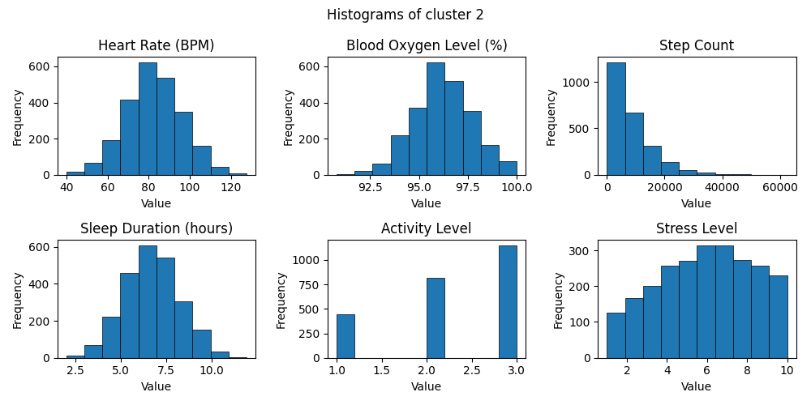

**Third Cluster**

*Thirds cluster analysis*

<table>
  <tr>
	<th></th>
	<th>Heart Rate (BPM)</th>
	<th>Blood Oxygen Level (%)</th>
	<th>Step Count</th>
	<th>Sleep Duration (hours)</th>
	<th>Activity Level</th>
	<th>Stress Level</th>
  </tr>
  <tr>
	<td>Count</td>
	<td>2796.00</td>
	<td>2796.00</td>
	<td>2796.00</td>
	<td>2796.00</td>
	<td>2796.00</td>
	<td>2796.00</td>
  </tr>
  <tr>
	<td>Minimum</td>
	<td>40.00</td>
	<td>93.88</td>
	<td>0.91</td>
	<td>-0.19</td>
	<td>1.00</td>
	<td>1.00</td>
  </tr>
  <tr>
	<td>Maximum</td>
	<td>109.60</td>
	<td>100.00</td>
	<td>57034.63</td>
	<td>10.50</td>
	<td>3.00</td>
	<td>10.00</td>
  </tr>
  <tr>
	<td>Mean</td>
	<td>69.56</td>
	<td>98.37</td>
	<td>8217.62</td>
	<td>6.07</td>
	<td>1.62</td>
	<td>7.56</td>
  </tr>
  <tr>
	<td>25th percentile</td>
	<td>59.88</td>
	<td>97.42</td>
	<td>2503.81</td>
	<td>5.11</td>
	<td>1.00</td>
	<td>6.00</td>
  </tr>
  <tr>
	<td>Median</td>
	<td>69.51</td>
	<td>98.55</td>
	<td>6097.05</td>
	<td>6.03</td>
	<td>1.00</td>
	<td>8.00</td>
  </tr>
  <tr>
	<td>75th percentile</td>
	<td>79.06</td>
	<td>99.64</td>
	<td>11769.42</td>
	<td>7.07</td>
	<td>2.00</td>
	<td>9.00</td>
  </tr>
  <tr>
	<td>Variance</td>
	<td>185.01</td>
	<td>1.88</td>
	<td>57680890.00</td>
	<td>2.16</td>
	<td>0.54</td>
	<td>4.08</td>
  </tr>
  <tr>
	<td>Standard Deviation</td>
	<td>13.60</td>
	<td>1.37</td>
	<td>7594.79</td>
	<td>1.47</td>
	<td>0.73</td>
	<td>2.02</td>
  </tr>
  <tr>
	<td>Skewness</td>
	<td>0.01</td>
	<td>-0.59</td>
	<td>1.62</td>
	<td>-0.03</td>
	<td>0.73</td>
	<td>-0.70</td>
  </tr>
  <tr>
	<td>ExcessKurtosis</td>
	<td>-0.41</td>
	<td>-0.39</td>
	<td>3.38</td>
	<td>-0.07</td>
	<td>-0.81</td>
	<td>-0.17</td>
  </tr>
</table>

*Third cluster histograms*

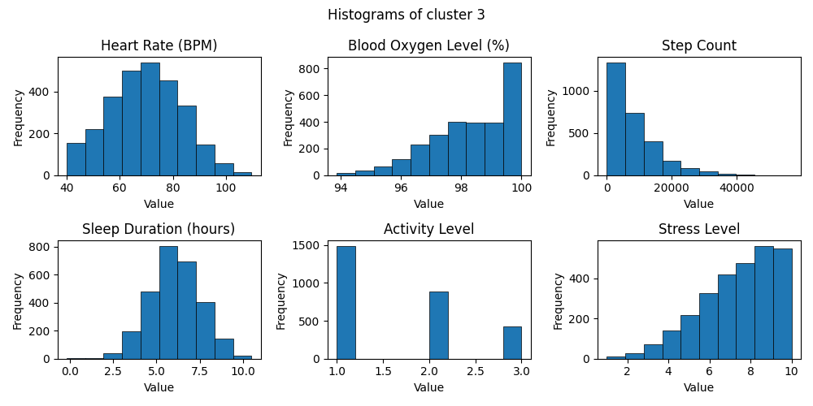

**Combined histograms**

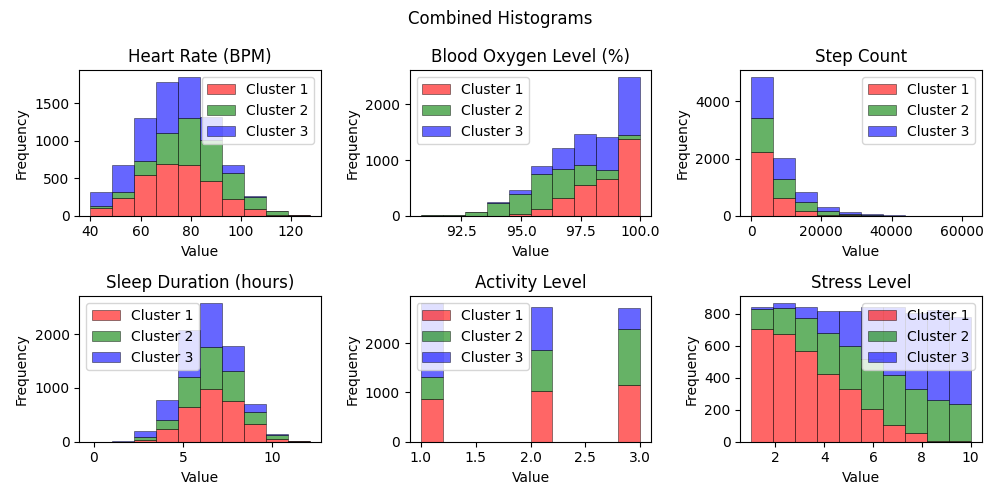

## Showcase of different clusters
Just a showcase of applying different number of clusters **without the additional analysis**.

*Data separated into 2 clusters*

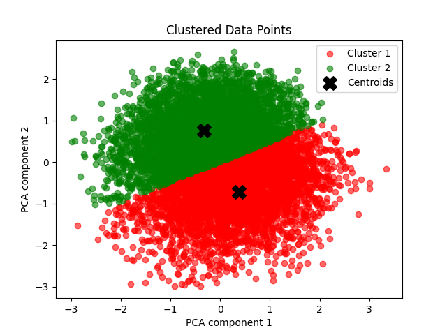

*Data separated into 4 clusters*

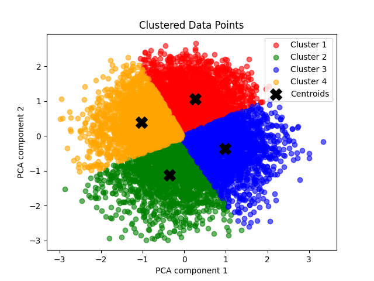

*Data separated into 5 clusters*

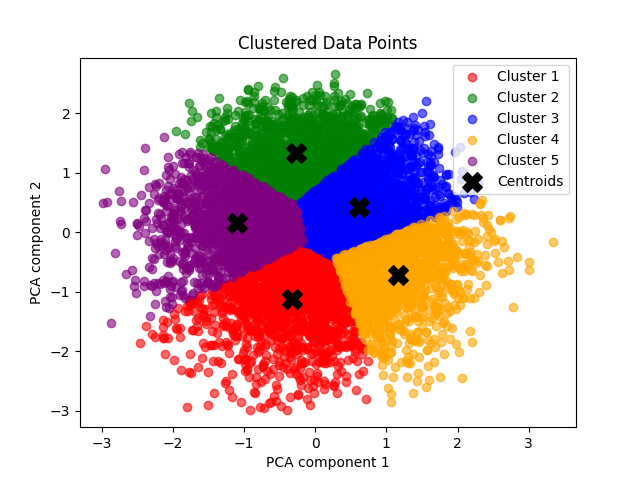

*Data separated into 6 clusters*

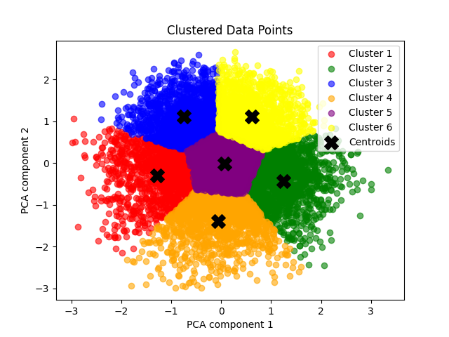

## Notes
- Keep eye on which variable is on which device
- Min-Max normalization doesn't go well with PCA
- PCA without normalization had significant data losses